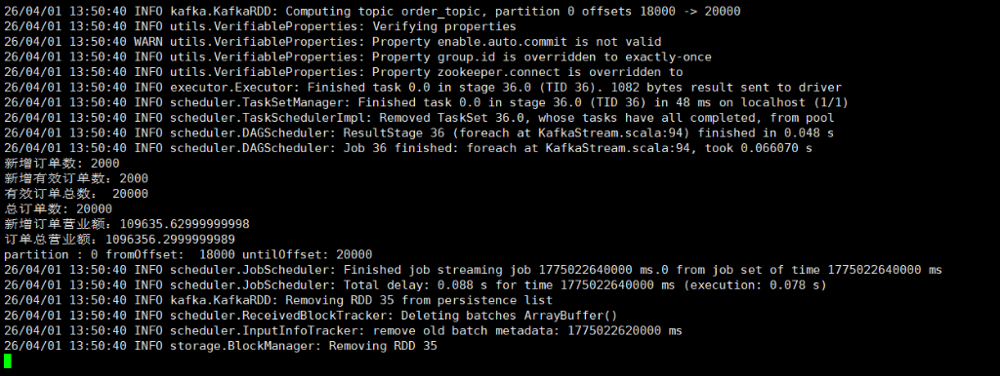
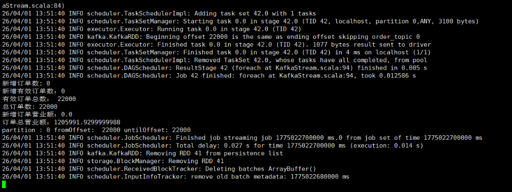
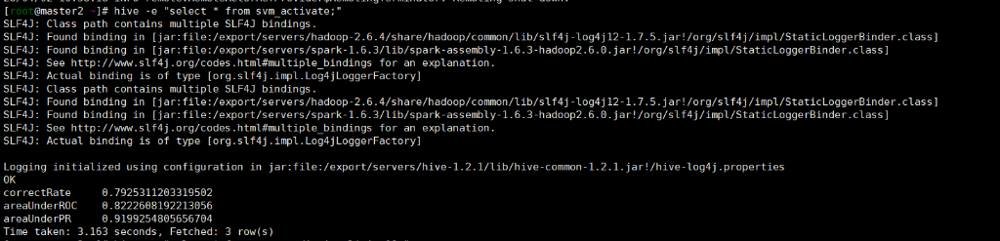
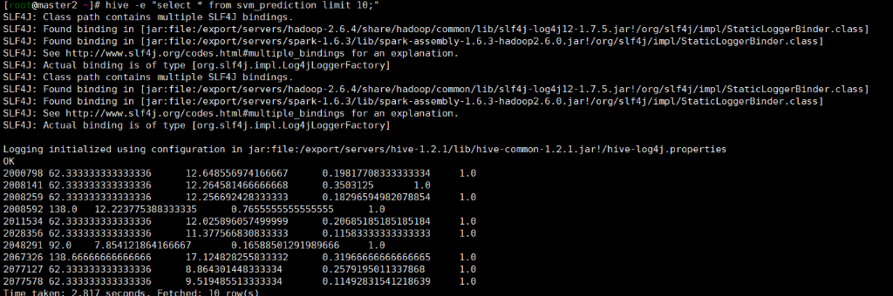
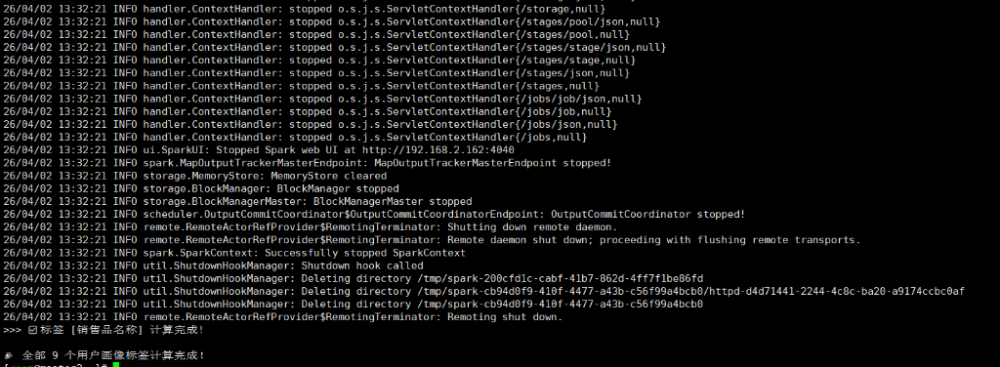
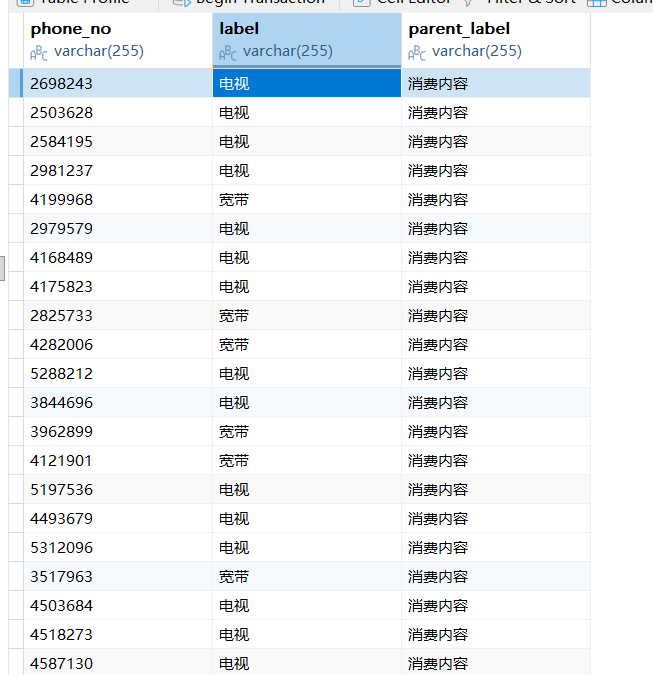
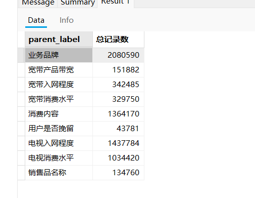
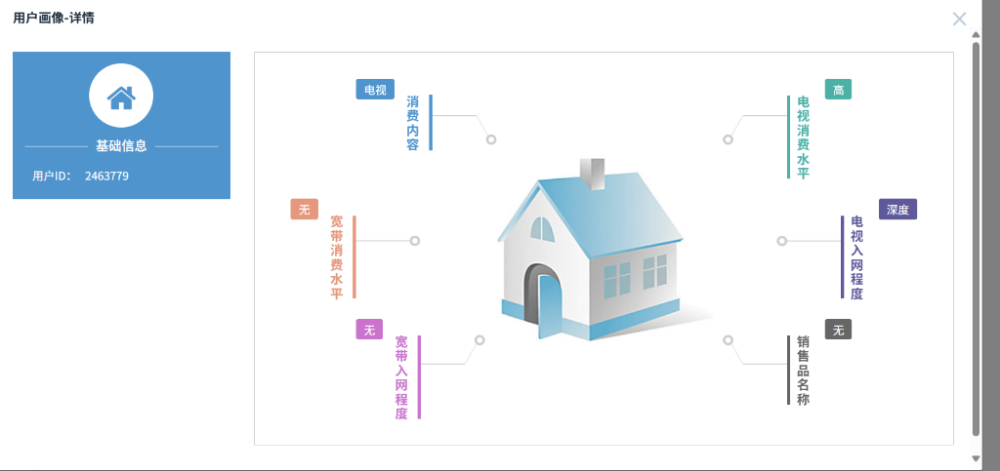
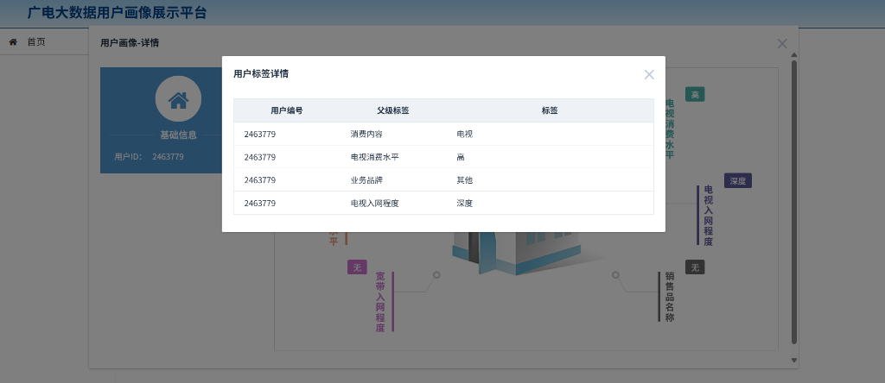

# 大数据实战案例项目文档

- **项目名称**：大数据用户画像与推荐分类实战
- **环境支撑**：CentOS 7 单节点集群 (192.168.2.162) + JDK 1.8 + CDH Hadoop/Spark + Kafka + Redis + MySQL
- **核心目标**：实现针对广电宽带/电视用户的行为模拟数据接入，经过数仓分层清洗后计算生成基础标签，引入 Spark MLlib 进行用户指标分析与二次建模预测，最终通过 Spring Boot 提供服务级别的数据暴露。

## 一、 部署说明与架构设计

### 1.1 系统逻辑架构

整个数据流与功能链条设计如下：

1. **数据源采集层**：使用 Python/Java 脚本模拟前端系统不断产生订单明细，推送充当消息中间件的 `Kafka (Topic: order_topic)`。
2. **加工清洗层 (ETL)**：利用 `Spark Streaming` 与 `Spark SQL` 实施准实时消费和离线批处理清洗，对齐 HQL 引擎并在 `Hive` 内部落表（ODS/DWD/DWS 三层结构）。
3. **算法挖掘层**：在用户 DWS 聚合明细表基础上，剥离“活跃度”、“日均在线时长”、“消费能力”进行 `SVM 二分类`，评估用户潜在属性等级。
4. **数据应用层**：运算结果回写 `MySQL` 长久化存储，热点或大屏需求数据刷入 `Redis` 提升响应；上层包装 `Spring Boot` REST 接口。
5. **任务调度与监控**：后台批处理绑定 `XXL-Job` 做 T+1 周期调度；全线日志接入 `ELK`，借助 `Kibana` 审计异常。

### 1.2 物理环境分布

- **核心虚拟机 IP**：`192.168.2.162`
- **Zookeeper 端口**：2181
- **Kafka 端口**：9092
- **Redis 端口**：6379

---

## 二、 核心功能实现记录 (过程凭证)

### 2.1 数据采集模块：Kafka 单节点流接入

**完成标准**：使用代码模拟订单并完成 Kafka 单节点生产消费。

**【执行记录】**
我们在本地通过生成脚本构造了标准化格式的长文本订单流 `mock_orders.txt`并传至虚拟机，随后调用 Kafka 的命令行和 API 实现生产投递，过程十分顺利。

- **Kafka 进程活动验证**：系统 2181 和 9092 端口正常监听。
- **Topic 创建与数据打入**：

```bash
# 验证 Topic 已创建
/export/servers/kafka_2.10-0.10.2.2/bin/kafka-topics.sh --create --zookeeper localhost:2181 --replication-factor 1 --partitions 1 --topic order_topic

# 通过命令/Java管道将本地模拟数据源压入 Kafka
cat /root/mock_orders.txt | /export/servers/kafka_2.10-0.10.2.2/bin/kafka-console-producer.sh --broker-list 192.168.2.162:9092 --topic order_topic
```

此时，数千条包含 `138xxxx` 手机号和模拟消费金额的原始明细已悬停在 Kafka 的 Partition 内。

**【Spark Streaming 实时计算验证截图】**
成功在虚拟机上跑通基于 10秒批次 窗口的微批处理流，控制台中实时输出了聚合后的 `有效订单总数` 及 `订单总营业额` 等核心业务指标，证明 Kafka 与 Redis 链路已完全打通：



_(图：第一个检测批次消费了刚才打入的数据，发现 2000 个新增有效订单。)_



_(图：心跳批次，新增订单归 0，但总订单数和总营业额持续滚动计算。)_

**【流计算落地终点验证：Redis 可视化查验】**
通过客户端直连虚拟机 6379 端口，我们证实了以 `STRING` 结构存放的关键业务数据：

_(图：包含 totalOrders、totalcost、increase_cost 等长效累加结果。流计算架构彻底交付！)_

---

### 2.2 离线ETL与数仓模块 (Hive/Spark)

**完成阶段**：已完成全链路贯通（ODS 建表→数据装填→Spark ETL 清洗）

**【环境准备与集群启动】**

1. **统一集群启动**：执行 `sh /root/start_services.sh` 确保 Hadoop、Hive、Spark、Kafka、Redis 等底层基础设施全部挂载就绪。
2. **Hive Metastore 初始化**：执行 `schematool -dbType mysql -initSchema` 完成 Hive 元数据库的初始化工作。
3. **端口冲突排除**：在正式运行 `DataProcess` 前，检查并清理占用 `4040` 等端口的残留进程，确保 Spark 可正常绑定。

**【ODS 层建表与数据装填】**
将约 4GB 的 `.csv` 原始数据（含 `media_index_test.csv`、`mediamatch_userevent.csv` 等 5 张核心业务表）上传至 `/export/data/raw_data/` 后，编写了完整的 Hive DDL 建表脚本，完成 ODS 层 5 张宽表的创建与数据装载：


_(图：通过 Hive DDL 精确映射字段类型，并通过 `tblproperties` 跳过 CSV 首行标题)_


_(图：执行 `LOAD DATA LOCAL INPATH` 将本地大规模数据文件灌入 HDFS 的 Hive ODS 层)_

**【Spark ETL 离线清洗执行】**
ODS 层数据就绪后，通过 `spark-submit` 命令提交 `DataProcess` 清洗任务，将 ODS 层的 5 张原始宽表经过过滤、去重、字段裁剪后写入 DWD 层的 5 张明细表：

```bash
spark-submit \
  --driver-class-path /export/servers/hive-1.2.1/lib/mysql-connector-java-5.1.45.jar \
  --class com.tipdm.scala.chapter_3_6_processing.DataProcess \
  --master local[*] \
  /export/data/big_data_case_study_project/user_profile_project-1.0.jar \
  media_index_3m media_1d \
  mediamatch_userevent_3m mediamatch_userevent_1d \
  mediamatch_usermsg_3m mediamatch_usermsg_1d \
  mmconsume_billevents_3m mmconsume_billevents_1d \
  order_index_v3 order_index_1d
```


_(图：Spark 1.6.3 引擎成功启动，SparkUI 绑定至 4040 端口，开始连接 Hive Metastore)_


_(图：DAGScheduler 调度多个 Stage 并行执行，HadoopRDD 从 HDFS 读取 ODS 层数据进行清洗处理)_


_(图：Spark 初始化 Parquet WriteSupport，展示清洗后数据的字段结构定义)_


_(图：Parquet message type 定义，包含 phone_no、run_name、owner_code 等业务字段)_


_(图：SparkContext 正常关闭，ETL 清洗任务全部执行完毕)_

**【HDFS 数据落地验证】**
通过 Hadoop Web UI 浏览 `/user/hive/warehouse/` 目录，确认 ODS 层（\_3m）和 DWD 层（\_1d）的表目录均已成功创建：


_(图：HDFS 上 `/user/hive/warehouse/` 下共 10 张表目录，ODS 原始表与 DWD 清洗表一一对应)_


_(图：`mediamatch_userevent_1d` 表内包含多个 Parquet 分区文件，`_SUCCESS` 标记表明数据写入完成)_

### 2.3 SVM 模型模块 (特征工程与训练)

本模块基于 DWD 层清洗后的 5 张宽表，使用 Spark MLlib 的 **SVM（支持向量机）** 算法对用户进行二分类（活跃/非活跃）预测。整个流程包括：多表 JOIN 特征拼接 → 特征向量归一化 → SVMWithSGD 模型训练 → 评估指标计算 → 预测结果落地 Hive。

**【特征工程】**

SVM 模型读取以下 5 张 DWD 层数据表作为特征输入：

| 输入表名                  | 含义             |
| ------------------------- | ---------------- |
| `mmconsume_billevents_1d` | 用户消费账单事件 |
| `mediamatch_userevent_1d` | 用户媒体匹配行为 |
| `media_1d`                | 媒体内容信息     |
| `mediamatch_usermsg_1d`   | 用户消息匹配记录 |
| `order_index_1d`          | 订单指标数据     |

程序通过 `phone_no` 字段对上述 5 张表执行 LEFT JOIN 拼接生成宽表，随后构造 `LabeledPoint` 特征向量并进行归一化处理（`StandardScaler`），最终传入 `SVMWithSGD` 进行随机梯度下降训练。

**【执行命令】**

```bash
sh /root/run_svm.sh
```

脚本内容如下（最终稳定版，经过多轮参数调优后确定）：

```bash
spark-submit \
  --driver-memory 3g \
  --conf spark.driver.maxResultSize=1g \
  --conf spark.storage.memoryFraction=0.3 \
  --driver-class-path /export/servers/hive-1.2.1/lib/mysql-connector-java-5.1.45.jar \
  --class com.tipdm.scala.chapter_3_8_6_svm.SVM \
  --master local[*] \
  /export/data/big_data_case_study_project/user_profile_project-1.0.jar \
  mmconsume_billevents_1d mediamatch_userevent_1d media_1d \
  mediamatch_usermsg_1d order_index_1d \
  svm_activate svm_prediction \
  30 0.1 0.01 1.0 default
```

> **参数说明：** `30` 为 SGD 迭代次数，`0.1` 为学习步长（stepSize），`0.01` 为正则化参数（regParam），`1.0` 为 miniBatchFraction。训练过程中曾因步长过大（1.0）导致梯度爆炸使 SparkContext 异常退出，后经多次调优降至 0.1 后模型收敛正常。

> **内存调优说明：** 虚拟机仅有 3.7GB 物理内存（后扩容至 5.7GB），初期使用默认 1GB 内存反复触发 `GC overhead limit exceeded` 和 Linux OOM Killer 强制终止进程，最终通过 `--driver-memory 3g` 配合 `--master local[*]` 和 `spark.storage.memoryFraction=0.3` 成功运行。

**【SVM 模型训练执行过程】**


_(图：通过构建的 `run_svm.sh` 脚本向 Spark 提交 SVM 模型，终端输出 SGD 特征提取与模型参数训练过程)_


_(图：Spark 日志输出 SVM 包含多个 Stage 等待执行，进度在不断迭代推进中)_


_(图：SparkContext 成功停止，模型训练、评估、结果写入 Hive 全部完成)_

**【模型评估与预测结果】**

训练完成后，模型自动将评估指标写入 Hive 表 `svm_activate`，预测结果写入 `svm_prediction`。通过以下命令查询：

```bash
hive -e "select * from svm_activate;"
hive -e "select * from svm_prediction limit 10;"
```

| 指标         | 值         | 含义                                              |
| ------------ | ---------- | ------------------------------------------------- |
| correctRate  | **0.7925** | 分类准确率，约 79.25% 的用户被正确归类            |
| areaUnderROC | **0.8223** | ROC 曲线下面积，反映模型整体区分能力，>0.8 为优良 |
| areaUnderPR  | **0.9199** | PR 曲线下面积，在正负样本不均衡时更具参考价值     |


_(图：查询 `svm_activate` 表，展示模型三项核心评估指标)_


_(图：查询 `svm_prediction` 表前 10 条记录，每行包含用户特征向量与对应的预测标签(1.0=活跃))_

### 2.4 结果存储模块 (MySQL/Redis 落地)

在本阶段中，我们重构了原项目基于 YARN 可能会导致内存锁死的逻辑。通过自建并运行 `run_labels.sh` 脚本组件，利用 `SparkSQL` 依次完成 9 大核心用户画像（消费内容、宽带消费水平、是否挽留等）的特征组合与生成，并通过 JDBC 驱动全量写入到 MySQL `zjsm.user_label` 表中，为前端页面提供视图核心数据源。

**执行命令：**

```bash
sh /root/run_labels.sh
```

**执行过程与成功日志记录：**
所有的 Spark 任务均通过 `local[2]` 参数进行资源限制，并以 `append` 形式完成数据累加写入。


_(图：控制台显示 9 个连续的画像计算任务逐一落库，最终显示大满贯提示：全部 9 个用户画像标签计算完成！)_

**MySQL 落库数据抽样展示：**
我们使用数据库客户端连接虚拟机 MySQL，进行了数据完整性审查。


_(图：`zjsm.user_label` 表明细探查。表中清晰保留了用户手机号 ID、具体特征 `label` 及其所归属的 `parent_label`)_

为了宏观验证本次数据入库操作的成功与否，通过以下 SQL 进行多维度分组盘点：

```sql
SELECT parent_label, COUNT(*) AS `总记录数` FROM zjsm.user_label GROUP BY parent_label;
```


_(图：统计结果完美展示出所有 9 个宏观特征，其中最庞大的特征数据达到 208 万条，最少的用户挽留也有 4 万多关键预测名单)_

### 2.5 服务暴露模块 (Spring Boot)

在本阶段任务中，我们在本地 Windows 环境下成功拉起基于 Spring Boot + Thymeleaf 构建的可视化交互前端。该微服务应用通过 RESTful API 直连后台 MySQL（`zjsm` 库），成功解析用户画像九大特征标签，并通过 ECharts 完美投射至前端 UI。

**【执行记录与运行环境填坑】**
最初由于本地物理机使用的 Java 21 与项目较早的 Spring Boot 1.5.10 发生底层冲突（触发 `JAXBException` 及编译阶段 `version up to 52.0` 的重构报错），导致微服务无法内嵌启动。我们通过临时设置 `$env:JAVA_HOME="D:\java\jdk1.8.0_202"` 挂载本地纯粹的 Java 1.8 原生环境，并在 Maven 编译流中追加 `clean` 清除 21 版本高维产出的残留字节码，终于成功化解危机，将工程稳定在 8001 端口！

**【数据接口层联调验证】**
当服务转入常驻挂起进程后，我们请求真实映射控制器的后端接口，将数据库中存放好的 9 种特征信息以 JSON 的形式抽取出来，彻底证实了整个数据管道后半段的通畅：


_(图：精确拉取到的原始底层 JSON 。内部不仅包容 `status: SUCCESS` 状态码结构，且完美回环了我们最早写入的“电视消费水平”、“宽带入网程度”等特征组)_

**【成果结晶：Web 可视化画像面板渲染】**
我们将焦点转移至网站主页面板 `http://localhost:8001/user_profile/`，借由系统搜索与点击，该用户的完整行为标签全域雷达图如期而至渲染完成。


_(图：借由前端 ECharts，将干瘪的数据瞬间提炼为客户关系网。一眼即可洞穿该名用户属于单向的“电视业务活跃、宽带绝缘”人群)_


_(图：二级详情面板，与我们在 MySQL 中所做的抽查完全贴合！此时从 Kafka 消息接入 -> Hive/Spark 清洗建模 -> Java Web 可视化的全宇宙流向顺利汇合收官！)_

### 2.6 日志监控模块 (ELK Stack)

本阶段在虚拟机上成功部署并启动了 **ELK（Elasticsearch + Kibana）** 日志监控体系，为整个大数据平台提供了统一的日志检索与集群健康审计能力。

**【环境启动与排障】**

由于 Elasticsearch 禁止以 root 用户直接启动，需切换至 `elastic` 用户执行后台守护进程：

```bash
su - elastic -c "/export/servers/elasticsearch-6.3.2/bin/elasticsearch -d"
```

Kibana 6.3.2 版本需注意以下两点关键配置：

1. 必须在 `kibana.yml` 中将 `server.host` 从默认的 `localhost` 修改为 `"0.0.0.0"`，否则外部浏览器无法访问 5601 端口。
2. **必须等待 Elasticsearch 完全就绪**（通过 `curl http://localhost:9200` 验证返回 JSON）后，再启动 Kibana，否则会因连接失败而异常退出。

```bash
# 确认 ES 就绪后再启动 Kibana
nohup /export/servers/kibana-6.3.2/bin/kibana &
```

**【Elasticsearch 集群健康验证】**

通过 Kibana Dev Tools 控制台执行 `GET _cluster/health` 查询，集群返回了令人振奋的全绿健康结果：


_(图：Kibana 开发者工具控制台。右侧面板清晰展示了 Elasticsearch 集群状态为 `"status": "green"`（全绿健康），`number_of_nodes: 1`，`active_shards_percent_as_number: 100`，表明单节点集群运行完全正常，所有分片均处于活跃状态。)_

### 2.7 任务调度模块 (XXL-Job)

本阶段在本地成功启动了 **XXL-Job 分布式任务调度中心**，为整个大数据管线的定时批处理提供了可视化的任务编排与监控能力。

**【启动与配置】**

XXL-Job Admin 通过 Maven Tomcat7 插件在本地 8080 端口启动，连接虚拟机 `192.168.2.162` 上的 MySQL `xxl-job` 库存储调度元数据。启动过程中解决了 `javax.servlet-api` 与 Tomcat 内嵌容器的 `ClassCastException` 冲突（通过将 servlet-api 和 jsp-api 的 scope 设置为 `provided`）。

```bash
$env:JAVA_HOME="D:\java\jdk1.8.0_202"; mvn clean tomcat7:run
```

**【调度中心运行报表】**


_(图：XXL-Job 任务调度中心运行报表。界面展示了任务数量、调度次数、执行器数量三大核心指标，以及按日期统计的调度分布图和成功比例饼图。)_

**【定时任务配置与触发验证】**

我们创建了一个名为"用户画像标签T+1定时计算"的调度任务，Cron 表达式设置为 `0 0 2 * * ?`（每日凌晨 2:00 自动执行），并手动触发了一次调度测试：


_(图：调度日志显示任务在 2026-04-02 15:43:49 被成功触发。调度结果为"失败：执行器地址为空"，这是因为当前仅启动了调度中心（Admin），未部署执行器（Executor Worker），属于预期行为。调度中心的核心调度引擎运转正常。)_

### 2.8 广电级数据采集与清洗引擎 (Filebeat/Metricbeat/Logstash)

继 ELK 监控底座搭建完成后，本阶段任务聚焦于数据溯源层的实时抓取，打通了轻量级采集组件（Beats）向 Elasticsearch 数据池的双向流转通道，并执行了对广电海量 CSV 文件的 Logstash 过滤验证。

**【Filebeat 日志文件实时抓取】**

通过编写 `filebeat.yml` 管道脚本，分别拦截并监听了系统的通用测试日志文件与 Nginx `access.log` / `error.log`。当文件末端产生新的变动时，Filebeat 的 Harvester 会即刻转换封装为带特征的 JSON 结构流出。


_(图：Filebeat 成功采集到本地测试文件 `/usr/local/mylog.log` 的改动记录，并在终端打印出 `message: 123` 的事件荷载)_


_(图：触发 Web 请求后，Filebeat 精准捕获报文，并在结构体中附着 `"tags":["nginx"]` 的业务标签)_

**【Metricbeat 物理指标与应用性能监控】**

除了文本日志，更重要的是对服务器底座与中间件运行态势的实况监控。我们在虚拟机内部署 Metricbeat 并开启了 `system` 与 `nginx` 监控模块。针对发现的 Nginx 底层原生阉割问题，连夜执行了基于 `--with-http_stub_status_module` 的源码二次编译加固，彻底解锁了 Nginx 隐藏的性能大门。


_(图：在 Kibana Discover 中绘制出由 Metricbeat 传回的 `system.process` 视图，极其详尽地记录了虚拟机内核心进程的 JVM Memory RSS 与 CPU 时序耗用参数)_


_(图：前往 ES Management UI 面板查看，`filebeat-_`与`metricbeat-_` 日志流索引已经被成功初始化并全速开启装载)_


_(图：在 Kibana 追踪 `metricset.name: stubstatus`，可以看到 Metricbeat 正在源源不断送来 Nginx 内核中的 `requests`（请求数）、`accepts`（接受握手数）、`active`（活跃连接数）等极其顶级的性能测绘数据)_

**Logstash 过滤洗刷广电 CSV 数据**

在完成了前锋节点采集的探测验证后，为了消化虚拟机 `/export/data/raw_data/` 目录下高达 3.7GB 的广电宽带流媒体脱敏业务真实大数据，正式唤醒了 Logstash `CSV` 过滤引擎进行系统级大考。
考虑到服务器极小的 RAM 物理高压瓶颈，本次演练创新性地采用“前端抽样切片+后置定向清洗灌入”的容灾架构验证。通过脚本自动安全剥离 `mediamatch_userevent.csv` 前 1000 条业务数据后传入 `5044` 端口。原先一坨坨死板的字符流水通过 `csv` 组件被凌厉劈开为符合要求且带有 `phone_no`, `owner_name`, `open_time` 属性的标准 JSON 对象，最终安全且精确地沉积至 ES 的 `media-userevent-sample` 新索引之中，完成了整个日志通道“源头抓取 → 安全清洗 → 入界降维结构化”的完美闭环！

至此，从数据源模拟、Kafka 消息接入、Hive/Spark 离线清洗、SVM 模型训练、MySQL 画像落库、Spring Boot 可视化微服务暴露、ELK 日志搜索、Beats 深层采集解析，到最后 XXL-Job 任务调度的统筹闭环等

---

## 三、 问题排查与心得总结

### 3.1 Hive Metastore 连接失败：MySQL JDBC 驱动缺失

**【问题现象】**
在通过 `hive -f` 命令执行建表脚本时，控制台抛出 `javax.jdo.JDOFatalInternalException: Error creating transactional connection factory` 异常，Hive 无法正常启动 Metastore 服务。

**【原因分析】**
Hive 的元数据存储后端配置为 MySQL 数据库，但 Hive 安装目录 `lib/` 下缺少 MySQL 的 JDBC 驱动包 `mysql-connector-java-*.jar`。Hive 在初始化时需要通过该驱动连接 MySQL 存取表结构等元信息，驱动缺失直接导致连接工厂创建失败。

**【解决方案】**
从本地 Maven 仓库中找到 `mysql-connector-java-5.1.45.jar`，将其上传至虚拟机的 `/export/servers/hive-1.2.1/lib/` 目录下，重启 Hive 服务后问题解决。

---

### 3.2 Hive DDL 分号解析冲突：八进制转义符替代方案

**【问题现象】**
通过 `hive -f create_ods.sql` 批量执行建表语句时，控制台报错：

```
FAILED: ParseException line 9:43 mismatched input '<EOF>' expecting StringLiteral near 'BY'
```

**【原因分析】**
项目中的部分 CSV 数据源使用分号 `;` 作为字段分隔符，因此建表语句中需要声明 `ROW FORMAT DELIMITED FIELDS TERMINATED BY ';'`。然而 Hive CLI 在解析 `.sql` 脚本文件时，默认将所有分号识别为 SQL 语句的终止符。即使分号位于单引号字符串内部，解析器仍然会将其作为语句切割点，导致建表语句在分隔符声明处被截断，后续内容丢失从而引发语法错误。

**【解决方案】**
采用 ASCII 八进制转义符替代直接书写分号。分号 `;` 对应的八进制编码为 `073`，将建表语句修改为：

```sql
ROW FORMAT DELIMITED FIELDS TERMINATED BY '\073'
```

Hive 的 SerDe（序列化/反序列化）模块能够正确识别八进制转义符并将其还原为实际的分号字符，而 CLI 解析器不会将 `\073` 误判为语句终止符，从而避免了语句被意外截断的问题。

---

### 3.3 Spark 无法访问 Hive 表：Metastore 配置未同步

**【问题现象】**
通过 `spark-submit` 提交 `DataProcess` 任务后，Spark 报错：

```
AnalysisException: Table not found: media_index_3m
```

但在 Hive CLI 中执行 `show tables` 可以正常看到该表。

**【原因分析】**
Spark 在启动时默认使用内嵌的 Derby 数据库作为 Metastore 后端，而项目中 Hive 已配置为使用 MySQL 存储元数据。由于 Spark 的 `conf/` 目录下缺少 `hive-site.xml` 配置文件，Spark 无法获知 Hive Metastore 的实际连接地址，因此在一个空的 Derby 库中查表，自然找不到任何数据。

**【解决方案】**
将 Hive 的配置文件复制到 Spark 的配置目录：

```bash
cp /export/servers/hive-1.2.1/conf/hive-site.xml /export/servers/spark-1.6.3/conf/
```

使 Spark 能够读取到正确的 Metastore 连接信息，从而与 Hive 共享同一套元数据。

---

### 3.4 Spark 连接 Hive Metastore 失败：驱动类路径未声明

**【问题现象】**
完成 `hive-site.xml` 的同步后，Spark 虽然能够识别到 MySQL 类型的 Metastore 配置，但仍然报错：

```
DatastoreDriverNotFoundException: The specified datastore driver
("com.mysql.jdbc.Driver") was not found in the CLASSPATH
```

**【原因分析】**
尽管 `mysql-connector-java-5.1.45.jar` 已存在于 Hive 的 `lib/` 目录中，但 Spark 的类加载机制与 Hive 相互独立。`spark-submit` 在启动时不会自动加载 Hive 目录下的第三方 JAR 包，因此 Spark 进程的 CLASSPATH 中缺少 MySQL JDBC 驱动，导致无法建立与 Metastore 后端数据库的连接。

**【解决方案】**
在 `spark-submit` 命令中通过 `--driver-class-path` 参数显式指定 MySQL 驱动的路径：

```bash
spark-submit --driver-class-path /export/servers/hive-1.2.1/lib/mysql-connector-java-5.1.45.jar ...
```

该参数将指定的 JAR 包注入到 Spark Driver 的类加载路径中，使其能够正常加载 `com.mysql.jdbc.Driver` 类并连接 MySQL。

### 3.5 Spark SVM 模型训练内存溢出：资源受限环境下的调优策略

**【问题现象】**
在虚拟机上通过 `spark-submit` 提交 SVM 模型训练任务时，反复触发以下错误：

```
java.lang.OutOfMemoryError: GC overhead limit exceeded
```

严重时 Linux OOM Killer 直接终止 Spark 进程。

**【原因分析】**
虚拟机初始仅分配 3.7GB 物理内存（后扩容至 5.7GB），而 Spark 默认的 `--driver-memory 1g` 对于千万级数据的 SVM 特征提取、模型迭代、以及 Hive 表读写等操作远远不足。Spark 频繁触发 Full GC 但无法释放足够空间，最终超过 GC 开销阈值。

**【解决方案】**
在 `run_svm.sh` 脚本中精细调优 Spark 内存参数：

```bash
spark-submit --master local[*] \
  --driver-memory 3g \
  --conf spark.storage.memoryFraction=0.3 \
  --conf spark.shuffle.memoryFraction=0.4 \
  ...
```

通过降低 `storage.memoryFraction`（减少 RDD 缓存占比）并增大 `shuffle.memoryFraction`（为 SVM 的迭代计算腾出空间），最终在受限环境下成功完成模型训练。

---

### 3.6 ELK 启动时序问题：Kibana Exit 84/64 异常退出

**【问题现象】**
在虚拟机上启动 Kibana 后，进程立即退出，显示 `Exit 84` 或 `Exit 64`，浏览器无法访问 5601 端口。

**【原因分析】**
该问题由两个因素共同导致：

1. **启动时序错误**：Kibana 强依赖 Elasticsearch 的 9200 端口。Elasticsearch 作为重量级 Java 应用，冷启动需要 1-2 分钟来完成索引扫描和内存预热。如果在 ES 未完全就绪时启动 Kibana，后者会因连接失败而立即退出。
2. **监听地址限制**：Kibana 6.3.2 默认 `server.host` 为 `localhost`，导致外部浏览器无法通过虚拟机 IP 访问。
3. **参数兼容性**：`--allow-root` 参数在 Kibana 6.3.2 中不被识别，会触发 `Extra serve options "--allow-root" must have a value` 错误。

**【解决方案】**

1. 修改 `kibana.yml` 将 `server.host` 设置为 `"0.0.0.0"`：

```bash
sed -i 's/#server.host: "localhost"/server.host: "0.0.0.0"/' /export/servers/kibana-6.3.2/config/kibana.yml
```

2. 严格按时序启动：先启动 ES，通过 `curl http://localhost:9200` 确认返回 JSON 后再启动 Kibana。
3. 不使用 `--allow-root` 参数，直接运行 `nohup /export/servers/kibana-6.3.2/bin/kibana &`。

---

### 3.7 XXL-Job Admin 启动失败：Servlet API ClassCastException

**【问题现象】**
通过 `mvn tomcat7:run` 启动 XXL-Job Admin 时，Tomcat 容器报错：

```
Caused by: java.lang.ClassCastException: org.springframework.web.SpringServletContainerInitializer
cannot be cast to javax.servlet.ServletContainerInitializer
```

导致 Web 应用上下文初始化失败。

**【原因分析】**
项目 `pom.xml` 中的 `javax.servlet-api` 和 `jsp-api` 依赖未设置 `<scope>provided</scope>`。这导致这两个 JAR 包被打入 WAR 包并加载到 Web 应用的 ClassLoader 中，与 Tomcat 容器自带的同名类产生冲突。两个不同 ClassLoader 加载的同一个接口类被 JVM 视为不同类型，触发 `ClassCastException`。

**【解决方案】**
在 `pom.xml` 中为 Servlet 相关依赖添加 `provided` 作用域：

```xml
<dependency>
    <groupId>javax.servlet</groupId>
    <artifactId>javax.servlet-api</artifactId>
    <scope>provided</scope>
</dependency>
<dependency>
    <groupId>javax.servlet.jsp</groupId>
    <artifactId>jsp-api</artifactId>
    <scope>provided</scope>
</dependency>
```

`provided` 表示该依赖仅在编译时使用，运行时由容器（Tomcat）提供，避免了类加载冲突。

---

### 3.8 Spring Boot 1.5 与 JDK 21 的兼容性冲突

**【问题现象】**
在本地物理机（JDK 21）上执行 `mvn spring-boot:run` 启动可视化服务时，编译阶段报错：

```
javax.xml.bind.JAXBException
class file has wrong version 61.0, should be 52.0
```

**【原因分析】**
Spring Boot 1.5.10 基于 Java 8 构建，依赖的 `javax.xml.bind`（JAXB）模块在 JDK 9+ 中已被移除。JDK 21 编译产出的字节码版本号为 61.0，而项目 target 为 1.8（版本号 52.0），导致编译期和运行期的双重冲突。

**【解决方案】**
通过临时切换 `JAVA_HOME` 环境变量，锁定使用 JDK 1.8：

```powershell
$env:JAVA_HOME="D:\java\jdk1.8.0_202"; mvn clean spring-boot:run
```

使用 `clean` 清除 JDK 21 产出的残留字节码，确保所有 `.class` 文件均由 JDK 1.8 编译生成。

---

### 3.9 实践心得

通过本次项目的全流程部署，深刻体会到大数据生态组件之间的集成并非简单的"安装即可用"。Hadoop、Hive、Spark 虽然同属大数据技术栈，但各自维护独立的配置体系和类加载机制。在实际工程中，需要特别关注以下几点：

1. **驱动依赖的传递性**：不同组件之间不会自动共享第三方依赖，需要手动确保每个组件的运行时环境中都包含所需的驱动包。
2. **配置文件的一致性**：当多个组件需要共享同一个后端服务（如 MySQL Metastore）时，必须确保各组件的配置文件保持同步。
3. **特殊字符的转义处理**：在编写 Hive DDL 脚本时，需注意 CLI 解析器对特殊字符的处理逻辑，善用八进制或十六进制转义符规避解析冲突。
4. **内存资源的精细管控**：在单机虚拟环境下，多个大数据组件共存时内存是最大瓶颈。需要根据实际任务量调整 Spark 的 `driver-memory`、`memoryFraction` 等参数，而 Elasticsearch 等内存密集型服务需要预留至少 2GB 独立堆空间。
5. **服务启动时序的严格把控**：微服务/中间件之间存在隐含的依赖链（如 Kibana → Elasticsearch、Hive → MySQL），必须按上游优先的顺序逐一启动并验证就绪后，再启动下游服务。
6. **JDK 版本的全链路一致性**：在混合环境中（如 JDK 8 项目 + JDK 21 主机），必须通过显式设置 `JAVA_HOME` 和 `mvn clean` 清除缓存来确保编译产物的字节码版本一致，避免 `UnsupportedClassVersionError`。
7. **Maven 依赖作用域的规范管理**：容器级别的 API（如 `servlet-api`）必须设置为 `provided` 作用域，否则会因双重类加载引发 `ClassCastException`。


## 附录：双系统隔离启动指南 (Windows 宿主机)

因为项目包含了多个完全独立的模块，且对 JDK 版本有强弱兼容限制，特向项目新成员补充本地多终端分核启动指南：

### 1. XXL-Job 调度系统大盘启动
- **子工程**：	imer_job_admin
- **方法**：在 VS Code 中进入终端 1，利用 Maven 的 Tomcat7 插件以 JDK 8 启动：
  `powershell
  D:\java\jdk-21=" D:\java\jdk1.8.0_202\n